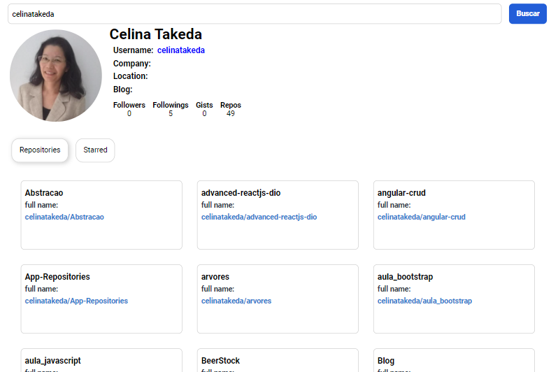

# Construindo interface componentizada com Reactjs

Neste projeto, desenvolvemos uma busca por um usuário no github.

Desenvolvido no ambiente Create React App com:

 - npx create-react-app my-app
 - cd my-app
 - npm start

Projeto com componentes reutilizáveis e consumindo api do github.

Estilização dos componentes utilizando styled componets.

Procura por infos, repo e starred pelo username.

## Visual do projeto

  

## Para aprender mais

https://pt-br.reactjs.org/

https://www.npmjs.com/

https://styled-components.com/

